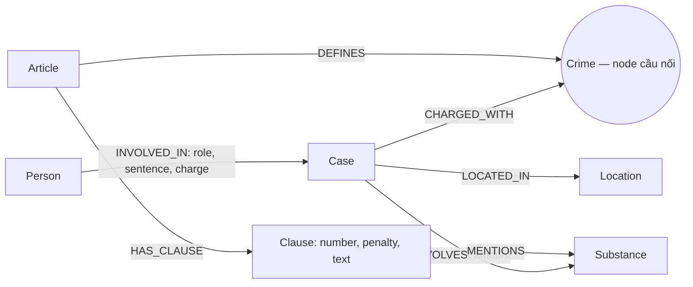

# Thiết kế Ontology — Day 19

**Họ tên:** Nguyễn Thành Duy  **MSSV:** 2A202602804

**Lựa chọn:** Dùng ontology gợi ý, bổ sung cách lấy ngữ cảnh cho câu hỏi về án tối đa và nhiều vụ.

## 1. Sơ đồ

## 2. Entity types

| Label | Ý nghĩa | Khóa `MERGE` | Properties chính | KB | Trích xuất |
| --- | --- | --- | --- | --- | --- |
| `Article` | Điều luật | `id`, ví dụ `Điều 251 BLHS` | `title`, `law`, `doc_id` | Luật | Metadata và regex |
| `Clause` | Khoản của Điều | `id` = Điều + khoản | `number`, `penalty`, `text`, `doc_id` | Luật | Regex |
| `Crime` | Tội danh chuẩn, cầu nối | `name` đã chuẩn hóa | `name` | Cả hai | Tiêu đề luật; LLM và `link_entity` cho tin |
| `Case` | Vụ việc được bài báo đề cập | `name` | `summary`, `date`, `doc_id`, `source_title` | Tin | LLM |
| `Person` | Người trong vụ | `name` | `aliases` | Tin | LLM |
| `Substance` | Chất ma túy | `name` | `name` | Cả hai | Từ điển cho luật; LLM cho tin |
| `Location` | Địa điểm | `name` | `name` | Tin | LLM |

`Crime` và `Substance` có thể được dùng chung bởi nhiều tài liệu nên không mang một `doc_id` duy nhất. Các node gắn với một tài liệu cụ thể (`Article`, `Clause`, `Case`) đều mang `doc_id` của tài liệu đó.

## 3. Relationships

| Type | Từ → Đến | Properties | Ý nghĩa |
| --- | --- | --- | --- |
| `DEFINES` | Article → Crime | — | Điều luật quy định tội danh |
| `HAS_CLAUSE` | Article → Clause | — | Điều luật gồm các khoản |
| `MENTIONS` | Clause → Substance | — | Khoản nhắc tới chất |
| `CHARGED_WITH` | Case → Crime | — | Vụ việc liên quan tội danh |
| `INVOLVES` | Case → Substance | `amount` | Chất và lượng trong vụ |
| `LOCATED_IN` | Case → Location | — | Địa điểm vụ việc |
| `INVOLVED_IN` | Person → Case | `role`, `charge`, `sentence` | Vai trò, tội danh và mức án của từng người |

## 4. Node cầu nối giữa 2 KB

- **Node:** `Crime`. Luật định nghĩa tội, tin tức thuật lại người hoặc vụ bị truy tố về tội đó.
- **Cách khớp:** Tên từ tiêu đề luật được bỏ tiền tố “Tội”, viết thường và chuẩn hóa khoảng trắng. Prompt yêu cầu LLM chọn từ danh sách chuẩn; `link_entity` thử khớp chính xác trước, rồi so gần đúng với ngưỡng 0,8. `MERGE` dùng tên chuẩn.
- **Khi cầu gãy:** Bài báo không nêu tội cụ thể, LLM bỏ sót hoặc dùng tên quá khác, hay tội không thuộc tập Điều luật đã nạp. Cần kiểm tra bài gốc theo `doc_id`, bổ sung quy tắc chuẩn hóa hoặc danh sách alias được kiểm duyệt; không tự nối bừa sang tội gần nhất.

## 5. Competency questions

| Câu | Đường đi dùng để trả lời | Trả lời được? |
| --- | --- | --- |
| Q1 | `Article {id:'Điều 2 Luật PCMT'} → HAS_CLAUSE → Clause`, hoặc đoạn văn luật từ vector search | Có; định nghĩa nằm trực tiếp trong văn bản, graph chỉ lưu theo khoản |
| Q2 | `Person → INVOLVED_IN {sentence:'tử hình'} → Case` | Có nếu LLM trích đúng từng bị cáo và án |
| Q3 | `Person {name:'Lê Minh Thành'} → INVOLVED_IN {sentence} → Case → CHARGED_WITH → Crime ← DEFINES ← Article → HAS_CLAUSE → Clause {number:1}` | Có |
| Q4 | `Person {aliases:['Hoàng Nato']} → Case → Crime ← Article → Clause`, xem khoản có khung cao nhất | Có nếu alias và tội được trích đúng |
| Q5 | `Person {name:'Cái Quang Huy'} → Case → INVOLVES → Substance {name:'MDMA'} ← MENTIONS ← Clause ← Article`; đối chiếu khối lượng trong `INVOLVES.amount` với văn bản khoản | Có, nhưng đối chiếu ngưỡng khối lượng hiện cần LLM đọc văn bản, chưa là phép so số có cấu trúc |
| Q6 | `Substance {name:'MDMA'} ← INVOLVES ← Case ← INVOLVED_IN ← Person` | Có với các vụ mà LLM đã nhận diện MDMA |

## 6. Quyết định thiết kế và đánh đổi

1. **Dùng `Crime` chung làm cầu nối.** Phương án khác là nối thẳng từng `Case` đến `Article`. Node tội danh giúp nhiều vụ dùng chung một căn cứ và dễ kiểm tra lỗi nối, nhưng phụ thuộc chuẩn hóa tên tội.
2. **Tách `Clause` khỏi `Article`.** Phương án khác là lưu toàn bộ Điều vào một node. Tách khoản cho phép lấy khung cơ bản hoặc khoản nhắc chất liên quan, giảm lượng luật đưa vào prompt; đổi lại chưa tách riêng từng điểm và ngưỡng khối lượng.
3. **Regex cho luật, LLM cho tin.** Phương án khác là dùng LLM cho cả hai. Luật có mẫu Điều/khoản ổn định nên regex ít tốn tiền và nhất quán; báo viết tự do cần LLM nhưng có thể bỏ sót hoặc trích sai thực thể.
4. **Mức án là thuộc tính `INVOLVED_IN`.** Nếu đặt ở `Case`, các bị cáo cùng vụ nhưng án khác nhau sẽ bị gộp sai. Đổi lại truy vấn phải lấy cả cạnh quan hệ.

## 7. So với ontology gợi ý

Ontology dùng các label và quan hệ gợi ý; không đề nghị chấm bonus tự thiết kế. Phần truy vấn mở rộng lấy thông tin từng người, các khoản luật khi hỏi mức phạt tối đa và nhiều vụ khi hỏi cùng một chất.

## 8. Hạn chế còn lại

`Case` và `Person` hiện dùng tên làm khóa; tên trùng hoặc cách viết khác có thể gộp nhầm hoặc tách đôi thực thể. `Substance` chưa có bảng alias đầy đủ (ví dụ biệt ngữ “kẹo” chỉ MDMA khi văn cảnh xác nhận). Khối lượng và ngưỡng pháp lý là chuỗi văn bản, nên Q5 còn phụ thuộc LLM đối chiếu. Các node dùng chung không thể mang một `doc_id` duy nhất; cần lần theo cạnh về tài liệu nguồn.
